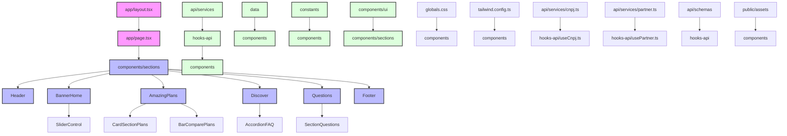

# Dental UNI - Auclan

Projeto de reestruturação do hotsite Dental UNI com Next.js, TypeScript e Tailwind CSS.

## 🚀 Tecnologias e Dependências

### Dependências Principais
- **Next.js 14.2.24:** Framework React para SSR/SSG.
- **React 18.2.0:** Biblioteca para construção de interfaces.
- **TypeScript 5.7.3:** Superset de JavaScript com tipagem forte.
- **Tailwind CSS 3.4.1:** Framework CSS utilitário.
- **Node.js v22.15.0:** Ambiente de execução.

Recomendamos manter as dependências atualizadas.

### Bibliotecas Chave
- **@radix-ui/react-accordion:** Componentes acessíveis de UI.
- **Mapas:** `@react-google-maps/api`, `react-leaflet`, `leaflet`.
- **swiper:** Carrosséis.
- **lucide-react:** Ícones.
- **Formulários/Validação:** `react-hook-form`, `@hookform/resolvers`, `zod`.
- **axios:** Cliente HTTP.
- **Utilitários/Plugins CSS:** `class-variance-authority`, `clsx`, `tailwind-merge`, `tailwind-scrollbar`, `tailwindcss-animate`.

## 🚀 Quick Start

Siga estes passos para configurar e rodar o projeto localmente:

1.  **Clone o repositório:**
    ```bash
    git clone <URL_DO_REPOSITORIO> # Substitua
    cd proj-dental-auclan
    ```

2.  **Instale as dependências:**
    ```bash
    npm install # ou yarn install
    ```

3.  **Configure variáveis de ambiente:** Crie `.env.local` (consulte a equipe para valores).
4.  **Rode o servidor:**
    ```bash
    npm run dev # ou yarn dev
    ```
    Disponível em `http://localhost:3000`.

### Exemplo Rápido: Chamada de API

Teste a API usando um hook como `useCnpj` em um componente (requer variáveis de ambiente).

```typescript
// Exemplo simplificado
'use client';

import { useCnpjValidation } from '@/api/hooks-api/useCnpj';
import { useEffect } from 'react';

function CnpjChecker() {
  const { validarCnpj, apiResponse, isLoading } = useCnpjValidation();

  useEffect(() => {
    validarCnpj({ cnpj: '' }); // Exemplo
  }, [validarCnpj]);

  if (isLoading) return <p>...</p>;
  if (apiResponse) return <p>Resposta: {JSON.stringify(apiResponse)}</p>;
  return <p>Aguardando...</p>;
}
```

Mais detalhes da API em [Auditoria](#%F0%9F%94%AC-auditoria-da-implementa%C3%A7%C3%A3o-da-api) e [`src/api/info.md`](src/api/info.md).

## 📁 Estrutura do Projeto

```
.
├── src/
│   ├── api/                    # Integrações com APIs
│   │   ├── config/
│   │   │   └── axios.ts       # Configuração do cliente HTTP
│   │   ├── hooks-api/         # Hooks para chamadas de API
│   │   │   ├── useCnpj.ts     # Hook para validação de CNPJ
│   │   │   └── usePartner.ts  # Hook para gerenciamento de parceiros
│   │   ├── schemas/           # Schemas de validação
│   │   │   ├── cnpj.ts
│   │   │   └── partner.ts
│   │   ├── services/          # Serviços de API
│   │   │   ├── cnpj.ts
│   │   │   ├── menu.ts
│   │   │   └── partner.ts
│   │   └── types/            # Tipos específicos da API
│   │       ├── cnpj.ts
│   │       ├── menu.ts
│   │       └── partner.ts
│   │
│   ├── app/                   # Páginas e layouts Next.js
│   │   ├── globals.css       # Estilos globais
│   │   ├── layout.tsx        # Layout principal
│   │   ├── not-found.tsx     # Página 404
│   │   └── page/             # Rotas da aplicação
│   │       ├── comparative/  # Página comparativa
│   │       ├── help/         # Página de ajuda
│   │       ├── page.tsx      # Página inicial
│   │       └── plans/        # Página de planos
│   │
│   ├── components/           # Componentes React
│   │   ├── sections/        # Seções da página
│   │   │   ├── AmazingPlans/    # Seção de planos
│   │   │   │   ├── BarComparePlans.tsx
│   │   │   │   ├── CardSectionPlans.tsx
│   │   │   │   ├── ListSectionPlans.json
│   │   │   │   └── SectionPlans.tsx
│   │   │   ├── Baneficiary/     # Seção de beneficiários
│   │   │   │   ├── FaqSection.tsx
│   │   │   │   └── SectionBeneficiary.tsx
│   │   │   ├── BannerHome/      # Banner principal
│   │   │   │   ├── BannerHome.tsx
│   │   │   │   └── SliderControl.tsx
│   │   │   ├── Discover/        # Seção de descoberta
│   │   │   │   ├── SectionDiscover.tsx
│   │   │   │   ├── discoverContent.json
│   │   │   │   └── faqData.json
│   │   │   ├── Footer.tsx       # Rodapé
│   │   │   └── Questions/       # Seção de perguntas
│   │   │       ├── SectionQuestions.tsx
│   │   │       └── questionsFaqData.json
│   │   └── ui/              # Componentes de UI reutilizáveis
│   │       ├── AccordionFAQ.tsx
│   │       ├── Button.tsx
│   │       ├── Container.tsx
│   │       ├── ReclameAqui.tsx
│   │       └── SmartAppLink.tsx
│   │
│   ├── constants/           # Constantes e configurações
│   │   ├── enums.ts        # Enums do sistema
│   │   ├── interfaces.ts   # Interfaces compartilhadas
│   │   ├── openingHours.ts # Horários de funcionamento
│   │   └── planos.ts       # Configuração de planos
│   │
│   ├── data/               # Dados estáticos e mocks
│   │   ├── accreditedNetwork/
│   │   │   └── qualificationsCaptions.ts
│   │   ├── blogContentMock.ts
│   │   ├── idssData.ts
│   │   ├── menuMock.ts
│   │   └── mockFaq.ts
│   │
│   ├── hooks/              # Hooks personalizados
│   │   ├── html-renderer.tsx
│   │   ├── use-formatted-date.ts
│   │   └── useFaqManager.ts
│   │
│   ├── lib/                # Utilitários
│   │   └── utils.ts
│   │
│   └── types/              # Tipos TypeScript
│       └── menuConfigMobile.ts
│
├── public/                 # Arquivos estáticos
│   ├── assets/
│   │   ├── icons/         # Ícones SVG
│   │   └── img/           # Imagens
│   ├── favicon.ico
│   └── fonts/             # Fontes personalizadas
│
├── next.config.js         # Configuração Next.js
├── package.json           # Dependências e scripts
├── postcss.config.mjs     # Configuração PostCSS
├── tailwind.config.ts     # Configuração Tailwind
└── tsconfig.json          # Configuração TypeScript
```

## 🔄 Fluxo de Interação dos Componentes



## 🛠️ Scripts Disponíveis

- `npm run dev`: Inicia dev server.
- `npm run build`: Gera build de produção.
- `npm run start`: Inicia server de produção.
- `npm run lint`: Executa linter.
- `npm run generate:icons`: Gera componentes de ícones SVG.

## 📝 Notas de Desenvolvimento

- **Componentes:** UI organizada por seções (`components/sections`) e reutilizável (`components/ui`). Dados por seção em JSON.
- **Dados/Config:** Estáticos/mocks em `data/`, constantes em `constants/`.
- **APIs:** Camada em `src/api/` com clientes, hooks, schemas e tipos.
- **Estilos:** Tailwind CSS com tema, variantes e animações.
- **Tipagem:** TypeScript, interfaces e tipos globais. Validação com Zod.
- **Testes:** Sem scripts de testes automatizados (`package.json`). Testes são recomendados para estabilidade.

## 📦 Boas Práticas e Reusabilidade

Foco em código limpo e reutilizável:

- **Sistema de Design:** Tokens globais via Tailwind para consistência.
- **Componentes UI:** Reutilizáveis, encapsulados (`src/components/ui`).
- **Lógica:** Hooks customizados (`src/hooks`, `src/api/hooks-api`) para lógica de estado, formatação, APIs.
- **Padrões:** Constantes, tipos (`src/constants`, `src/types`), utilitários (`src/lib`) centrais.
- **API:** Estrutura clara (`src/api`).
- **Geral:** Componentização, TypeScript, organização lógica, convenções.

## 📈 Arquitetura e Escalabilidade

Arquitetura modular para escalabilidade:

- **Modularidade:** Código dividido logicamente.
- **Next.js:** SSR/SSG para performance/escalabilidade.
- **API:** Camada desacoplada (`src/api/`).
- **Estado:** Predominantemente localizado (hooks, React Hook Form/Zod). Suporta adição futura de estado global.

## 🔬 Auditoria da Implementação da API

A auditoria da API em `src/api/` revela uma estrutura organizada e modular, fundamental para manutenibilidade e escalabilidade. Mais detalhes em [`src/api/info.md`](src/api/info.md).

### Estrutura e Organização
Camada de API dividida em: `config/`, `hooks-api/`, `schemas/`, `services/`, `types/`.

### Endpoints e Funcionalidades
Funcionalidades para: **CNPJ** (validação/consulta), **Partner** (gerenciamento), **Menu** (gerenciamento).

### Ferramentas e Tecnologias
- **Axios:** Cliente HTTP.
- **Zod:** Validação de dados.
- **React Hook Form:** Gerenciamento/validação de formulários.
- **TypeScript:** Tipagem forte.

### Observações
Estrutura robusta, favorece manutenibilidade. Validação com Zod aumenta confiança. Considerar testes automatizados e verificar implementação completa das funcionalidades de `info.md`.

## 🔒 Práticas de Segurança

Práticas para aumentar a segurança:

-   **Variáveis de Ambiente:** Info sensíveis (`.env.local`).
-   **HTTPS:** Comunicação criptografada.
-   **Validação de Dados:** Schemas Zod contra dados malformados.
-   **Tratamento de Erros:** Evita expor info sensíveis.

Para detalhes de segurança específicos da API, consulte [`src/api/info.md`](src/api/info.md). 